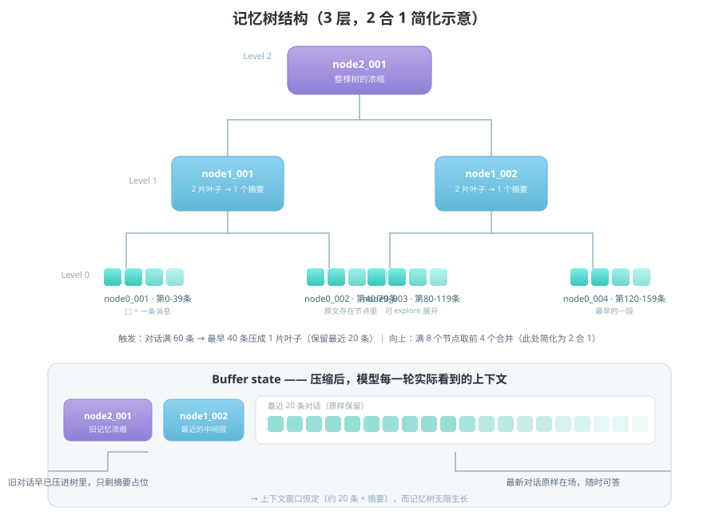
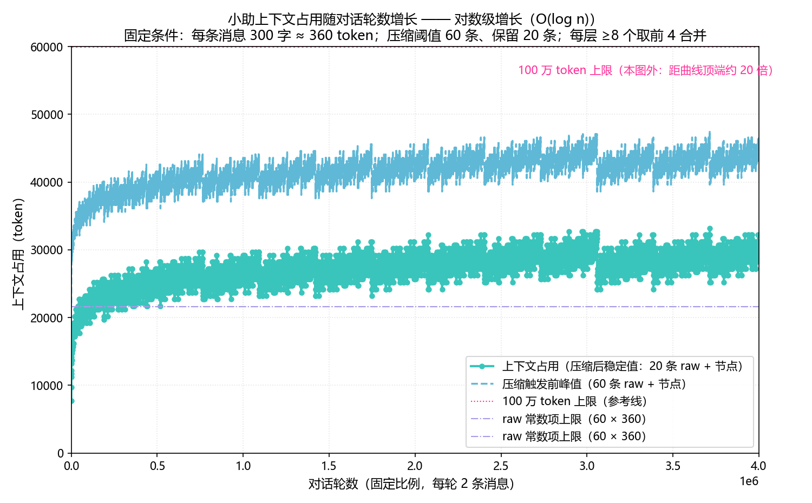
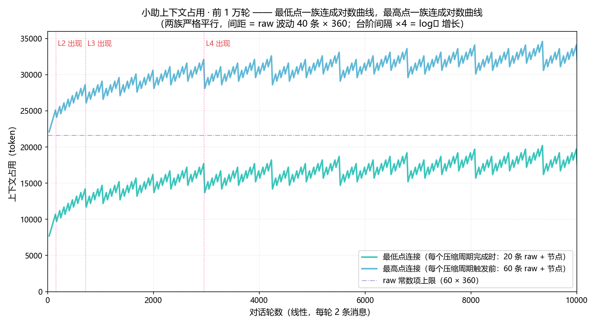

# DesktopAssistant（小助）

<p align="center">
  
</p>

面向个人学习的桌面 AI 助手。与以"代完成任务"为目标的主流 coding agent（Codex、Claude Code、OpenCode 等）不同，本项目的定位是**长期陪伴式学习辅助**：系统不代替用户完成工作，而是负责目标的拆解、进度的记录与提醒，并通过持久化的记忆结构维持对用户长期状态的认知。

核心设计要点：

- **长期记忆**：对话历史经压缩后沉淀为 SQLite 分层摘要记忆树（memory tree）。记忆容量近似无限，且随对话持续更新——系统能够回忆起数周前的对话内容，并据此维持一致的交互人设。
- **记忆驱动的提示词演化**：系统提示词保持极简，人设信息不预先写死，而是在对话过程中通过摘要机制（用户画像、偏好、目标等结构化字段）逐步累积与完善。
- **本地优先的感知能力**：语音合成（TTS）、语音识别（ASR）、图像文字识别（OCR）全部基于开源模型本地推理，离线可用；支持文档挂载、屏幕内容识别与网页检索，用于理解用户当前所处的任务情境。
- **桌面形态**：Electron 悬浮球常驻桌面，支持单击/长按/拖拽等交互，后端（Python + LangChain，LangGraph 化 ReAct 循环）由前端自动拉起。

## 系统架构

```
后端（Python, http://127.0.0.1:18771）
  server.py        ThreadingHTTPServer + JSON 端点（/chat /dequeue /settings /tts/* …）
  session.py       PlannerSession：并发控制、调度线程、事件队列、免打扰
  agent.py         create_agent 构建（LangGraph，无 checkpointer）
  middleware.py    业务中间件链（免打扰/计划快照/玩家优先/记忆压缩/调用上限）
  tools.py         工具注册（19 个 function calling，见下文）
  tts.py / asr.py / ocr.py   本地语音合成 / 识别 / 图像文字识别
  memory/          SQLite 分层摘要记忆树
  store/           任务/计划/待办库（SQLite）
前端（Electron）
  main.js          主进程：悬浮球窗口 + 面板窗口、托盘、HTTP 代理
  renderer/        悬浮球（bubble）与面板（index）页面、设置窗口
```

## 上下文管理：压缩与分层记忆树

大模型上下文窗口有界，而长期对话的需求是无限的。本项目以「压缩 + 分层摘要树」在二者之间建立平衡：

- **触发条件**：原始对话累积至阈值（默认 60 条）时，最早 40 条被压缩为一个叶子节点（`node0_xxx`）写入记忆树，上下文窗口回收至最近 20 条，生成成本保持恒定；
- **层级结构**：某层节点数量达到阈值（默认 8 个）时，前 4 个合并为上层节点（`node1_xxx`），逐层向上（4 合 1），直至根节点（`node2_xxx`）。节点携带摘要、用户画像、时间范围与全局序号区间；
- **缓冲区状态**：只有"最近一次压缩后尚未被进一步合并"的节点保留在上下文（buffer）中；被合并节点从 buffer 移除，永久沉淀于记忆树。



### 压缩中的未来信息校正

常规摘要式压缩将待压缩片段**孤立**地提交给模型，摘要无法反映该片段之后发生的事实变更（如用户推翻的决策、已完成的任务）。本项目压缩时，待压缩片段**原样包裹于指令中，追加到完整原始上下文的末尾**——模型可见被压缩区域之后（相对该区域而言属于"未来"）的全部消息，摘要据此获得**事后校正能力**：

- 后续对话否定的决策不会残留于摘要；
- 任务的最终状态（完成/变更）被纳入摘要而非停留在中途；
- 跨片段因果得以保持。

每一层摘要因此可视为"知情回顾"（informed retrospective），而非"截稿快照"（point-in-time snapshot）。

### 上下文复杂度的稳定性

压缩机制使上下文规模随对话轮数增长保持有界：



未引入记忆树时，上下文随轮数线性增长直至窗口上限（信息截断/遗忘）；引入后，上下文维持于稳定水位，10,000 轮对话不越界：



## 工具接口（function calling）

系统注册 19 个工具，由 LLM 在 ReAct 循环中自主调用：

| 工具 | 功能 |
|---|---|
| `create_task` | 录入新任务（对话触发） |
| `break_down_task` | 任务拆解为阶段与待办条目 |
| `list_tasks` / `get_task` | 任务列表 / 详情查询 |
| `get_next_actions` | 按紧急度排序的动态待办队列 |
| `mark_plan_done` | 勾选待办完成，任务状态自动推进 |
| `reschedule` / `update_task_status` / `prioritize` | 日期调整 / 状态更新 / 优先级调整 |
| `heartbeat` | 自主调度：设定下次唤醒（clamp 10~720 分钟） |
| `continue_speaking` | 长回复分段：调用后暂停片刻再继续（可被用户立即打断） |
| `set_do_not_disturb` | 免打扰时段（默认 22:00-08:00） |
| `explore_memory_tree` | 按需展开记忆树任意节点（历史回溯） |
| `list_dir` / `read_file` | 文档浏览 / 读取（PDF/Word/文本自动解析） |
| `capture_screen` | 屏幕截图 + OCR 文字识别 |
| `web_search` / `fetch_web` | 网页检索与内容抓取 |

## 功能特性

| 能力 | 说明 |
|---|---|
| 任务录入 | 对话（`create_task`）或 HTTP `POST /task` 结构化录入 |
| 任务拆解 | `break_down_task`：LLM 产出阶段与逐日计划并落库 |
| 每日计划 | 由任务拆解自动生成；前端可勾选完成 |
| 主动回访 | 调度线程：LLM 自主 `heartbeat(minutes)` 决定唤醒间隔 |
| 分段说话 | `continue_speaking`：分点输出时分段暂停（可打断） |
| 启动静默 | 启动 2 分钟宽限期；到期心跳顺延不补触发 |
| 免打扰 | 默认 22:00-08:00 静默（用户消息不受限） |
| 长期记忆 | 超阈值自动压缩入记忆树，`explore_memory_tree` 回溯 |
| 语音播报 | 本地 TTS：自动朗读 / 消息喇叭按钮 / 103 音色 / 开关与试听 |
| 语音输入 | 悬浮球长按 / 发送按钮长按，本地识别填入输入框 |
| 文件/感知 | 拖拽挂载（PDF/Word/文本 + OCR）、截屏、网页搜索 |

## 使用的开源模型

语音与视觉能力基于开源模型本地推理（数据不出本机）。语音识别与图片识别模型首次使用时自动下载；语音合成模型需按下方命令手动下载至缓存目录（`~/.cache/planner_tts`），此后离线可用：

| 模型 | 用途 | 说明 |
|---|---|---|
| [Kokoro-82M-v1.1-zh](https://huggingface.co/onnx-community/Kokoro-82M-v1.1-zh-ONNX) | 语音合成（TTS） | 82M 参数，ONNX 推理（无 torch），100+ 中英文音色；配合 [misaki](https://github.com/hexgrad/misaki) 音素管线 |
| [SenseVoiceSmall](https://github.com/FunAudioLLM/SenseVoice) | 语音识别（ASR） | 多语言识别，ONNX 版经 [funasr-onnx](https://github.com/altescy/funasr-onnx) 加载 |
| [RapidOCR](https://github.com/RapidAI/RapidOCR) | 图像文字识别（OCR） | PaddleOCR 的 ONNX 移植版（约 15MB） |

各模型许可证以对应项目仓库为准。语音输入/识别/OCR 全程本地处理；仅对话内容发送至所配置的 LLM API。

## 环境要求

| 依赖 | 版本 | 说明 |
|---|---|---|
| Python | ≥ 3.10 | 建议 3.11/3.12（3.13 可用，部分依赖版本受限） |
| Node.js | ≥ 18 | 前端（Electron）；仅运行后端可省略 |
| 操作系统 | Windows | 已适配 Windows（透明悬浮窗/托盘）；其他平台未验证 |

LLM 需为 OpenAI 兼容端点（默认 DeepSeek）。语音/OCR 能力全部本地推理，无需外部服务。

> 安装前确认 `python --version` 与 `node --version` 可正常执行。

## 安装与配置

### 1. 安装后端依赖

```bash
# 仓库根目录
python -m pip install -e .
```

### 2. 配置 LLM API

在仓库根目录创建 `.env`（已加入 .gitignore）：

```bash
LLM_API_KEY=sk-xxxxxxxxxxxxxxxxxxxx   # 必填
LLM_BASE_URL=https://api.deepseek.com # 可选
LLM_MODEL=deepseek-v4-flash           # 可选
```

亦可直接设置同名系统环境变量。

### 3. 启动

**方式一（推荐）**：仅启动前端，后端自动拉起：

```bash
cd frontend
npm install        # 首次
npm start
```

**方式二**：分别启动。先起后端：

```bash
python -m planner   # 监听 http://127.0.0.1:18771
```

再于另一终端启动前端（后端已运行则直接复用）：

```bash
cd frontend
npm install
npm start
```

**Mock 模式**（脚本化假 LLM，不消耗 API 额度，可演示任务全流程）：

```bash
set PLANNER_MOCK_LLM=1
python -m planner
```

语音合成模型（Kokoro-82M-zh，约 320MB，仅需下载一次）：

```bash
pip install "huggingface_hub[cli]"
hf download onnx-community/Kokoro-82M-v1.1-zh-ONNX --include "model.onnx" "voices/*" "tokenizer.json" --local-dir "%USERPROFILE%\.cache\planner_tts\models\onnx-community--Kokoro-82M-v1.1-zh-ONNX\snapshots\master"
```

### 4. 验证

- 访问 `http://127.0.0.1:18771/init`，返回 `{"ok": true, "mode": "llm"}` 即后端就绪；
- 悬浮球：单击查看最近回复；长按语音输入；拖拽文件挂载后随消息发送。

## 配置项（环境变量）

| 变量 | 默认 | 说明 |
|---|---|---|
| `PLANNER_PORT` | `18771` | 后端监听端口 |
| `PLANNER_MOCK_LLM` | 关 | `=1` 使用脚本化假 LLM |
| `PLANNER_DATA_ROOT` | `data/` | 运行时数据目录 |
| `PLANNER_PYTHON` | `python` | 前端拉起后端所用解释器 |
| `XIAOB_SHARED_ENV` | 无 | 共享 .env 路径（多项目复用 LLM 配置） |
| `PLANNER_HEARTBEAT_MIN_MINUTES` / `MAX` | `10` / `720` | 心跳间隔护栏（分钟） |
| `PLANNER_DND_START_HOUR` / `END_HOUR` | `22` / `8` | 免打扰窗口 |
| `PLANNER_TTS_ENGINE` | `local` | `cloud` 时改用 DashScope 云合成 |

## 数据存储

```
data/
  planner.db        任务/阶段/待办（WAL）
  memory_tree.db    记忆树节点 + 对话 buffer（WAL）
  logs/planner.log  运行日志（RotatingFileHandler）
```

**数据重置**：停止进程后删除 `data/` 目录即可（任务、记忆、日志全部清空）。

## 测试

```bash
python -m pytest tests -v
```

覆盖：记忆树存储、任务库 CRUD、agent 生成管线（mock 驱动任务闭环）、心跳护栏与启动静默、免打扰、buffer 重启恢复、HTTP 端点集成、语音合成/识别、事件消费。全部测试以 mock LLM + tmp_path 隔离，不调用真实 API、不写入真实数据。
